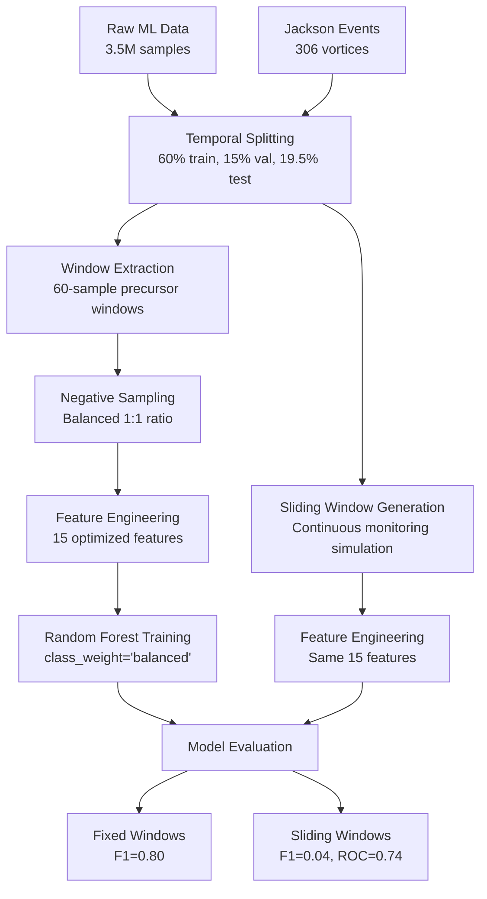

# 🔴 Mars Vortex Detection with Random Forest

**Intelligent, Power-Efficient Detection of Martian Atmospheric Vortices Using Classical Machine Learning**

[](https://www.python.org/)
[](https://scikit-learn.org/)
[](LICENSE)

---

## 📋 Table of Contents

- [Overview](#overview)
- [Project Goals](#project-goals)
- [Quick Start](#quick-start)
- [Pipeline Architecture](#pipeline-architecture)
- [Performance Results](#performance-results)
- [File Structure](#file-structure)
- [Usage Guide](#usage-guide)
- [Key Features](#key-features)
- [Citation](#citation)

---

## 🌍 Overview

This project implements a **Random Forest classifier** for detecting Martian dust devils (atmospheric vortices) using time-series pressure data. The model is designed for **on-board inference** on resource-constrained hardware like the **Qualcomm Snapdragon processor** used on NASA's Ingenuity Mars helicopter.

### Why Random Forest?

While modern deep learning (LSTMs, Transformers) shows promise for time-series tasks, Random Forests offer unique advantages for Mars missions:

- ⚡ **Fast inference**: <3ms per prediction
- 🔋 **Low power**: No GPU required
- 📦 **Small footprint**: ~372 KB model
- 🔍 **Interpretable**: Feature importance analysis
- 🎯 **Proven reliability**: Classical ML stability

---

## 🎯 Project Goals

1. **Enable Intelligent Data Collection**
   - Detect vortices as they approach the instrument
   - Trigger high-rate data collection before peak passes
   - Save power and storage by avoiding continuous high-rate collection

2. **Maintain Temporal Causality**
   - Use only past data to predict future events
   - No data leakage between train/validation/test splits
   - Time-based evaluation for realistic performance assessment

3. **Optimize for Edge Deployment**
   - 15 efficient features (no heavy computations)
   - Suitable for Qualcomm Snapdragon processor
   - Real-time capable (<10 ms end-to-end)

4. **Handle Extreme Class Imbalance**
   - Vortex events are rare (~0.5% of data)
   - Balanced training with realistic evaluation
   - Precision/recall trade-offs for mission requirements

---

## 🚀 Quick Start

### Prerequisites

```bash
Python 3.10+
pandas
numpy
scikit-learn
scipy
tqdm
```

### Installation

```bash
# Install dependencies
pip install -r requirements.txt
```

### Run Complete Pipeline

```bash
# 1. Temporal split only (canonical entrypoint)
python "core pipeline scripts/split_data.py"

# 2. Extract positive windows only
python "core pipeline scripts/extract_windows.py" --split all --window_size 60

# 3. Generate balanced datasets
python "core pipeline scripts/negative_sampling.py" --split train --ratio 1.0 --window_size 60 --buffer 50
python "core pipeline scripts/negative_sampling.py" --split val --ratio 10.0 --window_size 60 --buffer 50
python "core pipeline scripts/negative_sampling.py" --split test --ratio 10.0 --window_size 60 --buffer 50

# 4. Engineer features for train/val/test
python "core pipeline scripts/feature_engineering.py" --split train --window_size 60
python "core pipeline scripts/feature_engineering.py" --split val --window_size 60
python "core pipeline scripts/feature_engineering.py" --split test --window_size 60

# 5. Train RF with validation-selected threshold
python "core pipeline scripts/train_rf_model.py" --features_dir "." --primary_metric f1

# 6. Generate sliding windows for realistic evaluation
python sliding_window_generator.py --split val --step_size 10
python sliding_window_generator.py --split test --step_size 10

# 7. Evaluate on sliding windows (deployment simulation)
python sliding_window_evaluation.py
```

Canonical run order is also documented in `core pipeline scripts/PIPELINE_ORDER.md`.
For new experiments, avoid `core pipeline scripts/temporal_splits.py` and use `core pipeline scripts/split_data.py`.

---

## 🏗️ Pipeline Architecture



### Key Design Decisions

1. **Temporal Splitting with Gaps**
   - 60% training, 0.5% gap, 15% validation, 0.5% gap, ~19.5% test
   - Gaps prevent data leakage
   - Chronological order maintained

2. **Window Size: 60 Samples**
   - Based on NASA scientist guidance
   - Captures precursor region before vortex
   - Right boundary = last `gt_detection_win=True` sample

3. **Dual Evaluation Strategy**
   - **Fixed windows**: Model performance on aligned data
   - **Sliding windows**: Deployment simulation with realistic distribution

4. **Feature Set: 15 Features**
   - Trend: 4 features (slope, consistency)
   - Pressure drop: 3 features (magnitude, rate, position)
   - Statistical: 5 features (mean, std, range, ratios)
   - Anomaly: 3 features (z-scores, deviations)

---

## 📊 Performance Results

### Fixed-Window Evaluation (Training-like Scenario)

| Split | F1-Score | Precision | Recall | ROC AUC | Windows |
|-------|----------|-----------|--------|---------|---------|
| **Validation** | 0.7255 | 0.6727 | 0.7872 | 0.9557 | 517 |
| **Test** | **0.8000** | **0.7143** | **0.9091** | **0.9849** | 242 |

**✅ Excellent performance when windows are well-aligned!**

### Sliding-Window Evaluation (Deployment Scenario)

| Split | F1-Score | Precision | Recall | ROC AUC | Windows |
|-------|----------|-----------|--------|---------|---------|
| **Validation** | 0.0483 | 0.0255 | 0.4686 | 0.8091 | 53,847 |
| **Test** | 0.0377 | 0.0200 | 0.3421 | 0.7437 | 85,925 |

**⚠️ Low precision due to extreme class imbalance (~99.5% negative windows)**

### Key Insights

1. **Distribution Shift Challenge**
   - Training: 1:1 balanced ratio
   - Deployment: ~200:1 imbalanced ratio
   - Model produces too many false positives on imbalanced data

2. **Feature Importance**
   - `second_half_slope` (21.8%): Late-window pressure trend
   - `pressure_drop` (13.5%): Total pressure decrease
   - `range` (13.1%): Pressure variability

3. **Deployment Recommendations**
   - Use hybrid 2-stage detection (threshold + RF)
   - Calibrate decision threshold on validation sliding windows
   - Implement temporal voting (e.g., 3 out of 5 consecutive positives)
   - Target mission-specific precision/recall trade-offs

---

## 📁 File Structure

```
Vortex backup/
│
├── 📄 README.md                        # This file
├── 📄 EVALUATION_SUMMARY.md            # Detailed performance analysis
├── 📄 requirements.txt                 # Python dependencies
│
├── 🔧 Core Pipeline Scripts
│   ├── split_data.py                   # Temporal splitting only (canonical)
│   ├── extract_windows.py              # Positive window extraction only
│   ├── PIPELINE_ORDER.md               # Canonical command order
│   ├── data_preparation.py             # Legacy combined split+extract
│   ├── feature_engineering.py          # 15-feature computation
│   ├── negative_sampling.py            # Balanced training data generation
│   ├── train_rf_model.py               # RF training + validation threshold sweep
│   ├── sliding_window_generator.py    # Continuous monitoring simulation
│   └── sliding_window_evaluation.py   # Deployment evaluation
│
├── 📊 Data Files
│   ├── ml_ready_vortex_data.csv       # Raw pressure data (3.5M samples)
│   ├── Jackson_vortex_detections_reformatted_augmented.csv  # Ground truth
│   │
│   ├── temporal_splits/               # Time-based splits
│   │   ├── ml_train.csv               # Training pressure data
│   │   ├── ml_val.csv                 # Validation pressure data
│   │   ├── ml_test.csv                # Test pressure data
│   │   ├── jackson_train.csv          # Training vortex events
│   │   ├── jackson_val.csv            # Validation vortex events
│   │   └── jackson_test.csv           # Test vortex events
│   │
│   ├── train_windows.csv              # 188 positive training windows
│   ├── train_balanced.csv             # 450 balanced windows (train)
│   ├── train_features.csv             # Engineered features (train)
│   │
│   ├── val_sliding_windows_step10.csv   # 53,847 validation windows
│   └── test_sliding_windows_step10.csv  # 86,159 test windows
│
├── 🤖 Models & Results
│   ├── models/
│   │   ├── rf_vortex_detector_*.pkl   # Trained Random Forest
│   │   └── model_metadata_*.json      # Training configuration + threshold policy
│   │
│   └── results/
│       ├── feature_importance.csv      # Feature ranking
│       └── validation_threshold_sweep.csv  # Threshold search on validation
│
└── 📝 Legacy Scripts (deprecated)
    ├── temporal_splits.py              # Deprecated split script (use split_data.py)
    └── Anita copy 2.py                 # Original approach
```

---

## 📖 Usage Guide

### 1. Data Preparation (Modular)

```bash
# Split only
python "core pipeline scripts/split_data.py"

# Extract windows only
python "core pipeline scripts/extract_windows.py" --split all --window_size 60

# Output: temporal_splits/ directory with train/val/test splits
#         train_windows.csv, val_windows.csv, test_windows.csv
```

**Configuration:**
- `TRAIN_RATIO = 0.60`: 60% of data for training
- `GAP_RATIO = 0.005`: 0.5% gap between splits (~2 hours)
- `VAL_RATIO = 0.15`: 15% for validation
- `WINDOW_SIZE = 60`: 60 samples backward from precursor

### 2. Negative Sampling

```bash
# Generate balanced training data (1:1 positive:negative ratio)
python negative_sampling.py --split train --ratio 1.0 --buffer 50

# Output: train_balanced.csv with 450 windows (225 positive + 225 negative)
```

**Parameters:**
- `--ratio`: Negative to positive ratio (1.0 = balanced)
- `--buffer`: Buffer samples around positive events (avoids contamination)

### 3. Feature Engineering

```bash
# Engineer 15 optimized features
python feature_engineering.py --split train

# Output: train_features.csv with 450 rows × 16 columns (15 features + label)
```

**Features computed:**
- Trend: slopes, consistency
- Pressure: drop, rate, position
- Stats: mean, std, range
- Anomaly: z-scores, deviations

### 4. Model Training

```bash
# Train Random Forest with validation-selected threshold (frozen for test)
python "core pipeline scripts/train_rf_model.py" \
  --features_dir "." \
  --primary_metric f1 \
  --threshold_grid "0.05,0.10,0.15,0.20,0.25,0.30,0.35,0.40,0.45,0.50,0.55,0.60,0.65,0.70,0.75,0.80,0.85,0.90,0.95"

# Output: models/rf_vortex_detector_*.pkl
#         results/feature_importance.csv
#         results/validation_threshold_sweep.csv
```

**Model Performance (Fixed Windows):**
- Validation F1: 0.7255
- Test F1: 0.8000
- ROC AUC: 0.9849

### 5. Sliding Window Evaluation

```bash
# Generate sliding windows (step=10 samples)
python sliding_window_generator.py --split val --step_size 10
python sliding_window_generator.py --split test --step_size 10

# Evaluate on sliding windows
python sliding_window_evaluation.py

# Output: Comprehensive evaluation metrics on realistic deployment scenario
```

**NASA Labeling Logic:**
- `True`: Right-hand side of window in `gt_detection_win` (precursor)
- `False`: Right-hand side before `gt_detection_win`
- `Omit`: Right-hand side in `gt_fwhm` (actual vortex) or after

---

## ✨ Key Features

### 🔬 Time-Series Best Practices

- ✅ **Temporal causality**: No future information used
- ✅ **Time-based splits**: Chronological train/val/test
- ✅ **Gaps between splits**: Prevents data leakage
- ✅ **Sliding window evaluation**: Realistic deployment simulation
- ✅ **Balanced training, natural evaluation**: Best of both worlds

### 🚀 Deployment-Ready

- ✅ **Fast inference**: <3ms per prediction
- ✅ **Low power**: No GPU required
- ✅ **Small model**: ~372 KB
- ✅ **Efficient features**: Optimized for Snapdragon
- ✅ **Interpretable**: Feature importance analysis

### 📊 Comprehensive Evaluation

- ✅ **Fixed windows**: Training-like performance
- ✅ **Sliding windows**: Deployment simulation
- ✅ **Multiple metrics**: Precision, Recall, F1, ROC AUC
- ✅ **Confusion matrices**: Detailed error analysis
- ✅ **Feature importance**: Model interpretability

---

## 🎓 Academic Context

This work contributes to:

1. **Mars Science**: Understanding atmospheric dynamics through intelligent data collection
2. **Edge AI**: Demonstrating classical ML viability for space applications
3. **Time-Series ML**: Best practices for temporal causality and realistic evaluation
4. **Resource-Constrained ML**: Balancing performance with computational efficiency

### Related Work

- **Statistical thresholds**: Simple but limited generalization
- **LSTMs**: Better temporal modeling but higher computational cost
- **Transformers**: State-of-the-art but infeasible for edge deployment
- **Random Forests**: ✅ Best trade-off for this application

---

## 📈 Future Work

1. **Threshold Calibration**
   - Tune decision threshold on validation sliding windows
   - Target mission-specific precision/recall requirements
   - Implement Platt scaling or isotonic regression

2. **Temporal Voting**
   - Require N consecutive positive predictions
   - Reduce false positives in continuous monitoring
   - Test different voting strategies (majority, unanimous, etc.)

3. **Hybrid Detection**
   - Stage 1: Simple threshold (always on, low power)
   - Stage 2: Random Forest (activates on Stage 1 trigger)
   - Stage 3: High-rate data collection (activates on Stage 2 confirmation)

4. **Hardware Benchmarking**
   - Deploy on Qualcomm Snapdragon development board
   - Measure actual power consumption and inference time
   - Optimize for fixed-point arithmetic

5. **Model Comparison**
   - Compare with LSTM and Transformer baselines
   - Analyze power/performance trade-offs
   - Quantization and compression experiments

---

## 🤝 Contributing

This project is part of ongoing research on intelligent sensing for Mars missions. Contributions, suggestions, and feedback are welcome!

**Areas for contribution:**
- Alternative feature engineering approaches
- Threshold calibration strategies
- Hardware deployment optimizations
- Visualization and analysis tools

---

## 📝 Citation

If you use this work in your research, please cite:

```bibtex
@software{mars_vortex_rf_2025,
  title={Random Forest for Mars Vortex Detection: Efficient On-Board Inference},
  author={[Your Name]},
  year={2025},
  url={https://github.com/[your-repo]},
  note={Random Forest classifier for detecting Martian atmospheric vortices 
        with optimized features for edge deployment}
}
```

---

## 📄 License

MIT License - See LICENSE file for details

---

## 🙏 Acknowledgments

- **NASA Scientists**: For providing ground truth vortex detections and domain expertise
- **Jackson Dataset**: High-quality labeled vortex events from Mars missions
- **scikit-learn**: Excellent Random Forest implementation
- **Mars 2020 Mission**: Inspiration for on-board intelligent sensing

---

## 📞 Contact

For questions, suggestions, or collaborations:
- 📧 Email: [your-email]
- 🐙 GitHub: [your-github]
- 📄 Paper: [link-when-published]

---

**Status**: ✅ **Project Complete** - Ready for hardware benchmarking and deployment optimization

**Last Updated**: October 9, 2025

---

*"Enabling intelligent, power-efficient science on Mars, one prediction at a time."* 🔴🚁


